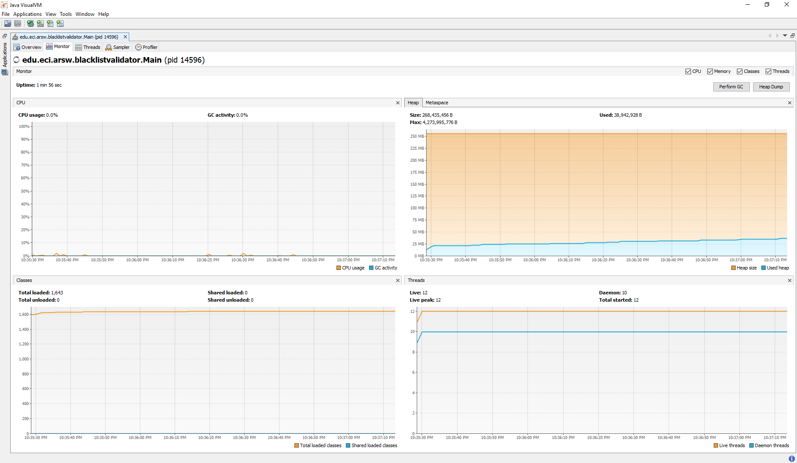
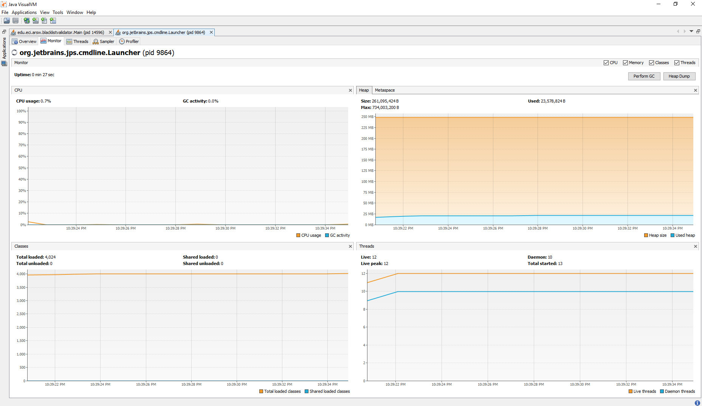
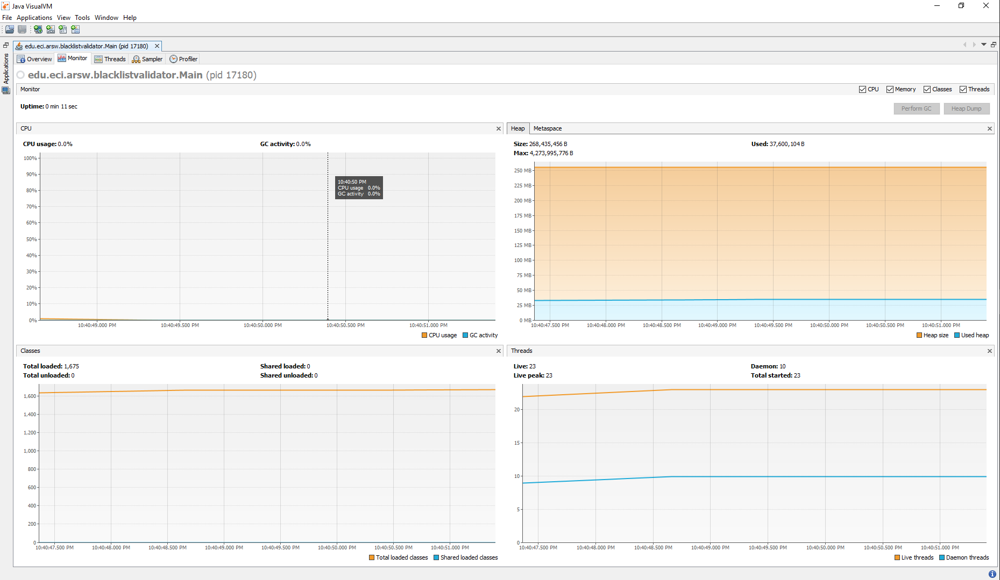
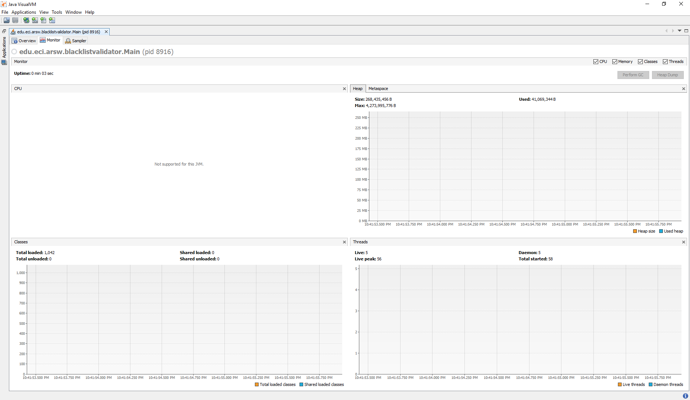

# LABORATORIO No.01 - ARSW
Integrantes:
* Diego Alejandro Murcia Céspedes

## PARTE I - INTRODUCCIÓN A HILOS EN JAVA
Al ejecutar start() los números aparecen de forma secuencial, de menor a mayor, en cambio a ejecutar run() los números
aparecen en desorden. Esto sucede porque al ejecutar el método run() este corre en un nuevo hilo, mientras que con el
método run() no se crea un nuevo hilo y este se ejecuta sobre el hilo actual en ejecución.

## PARTE III - EVALUACIÓN DE DESEMPEÑO
A continuación se mostrará la ejecución del programa en solution al problema de **Black List Search**, los resultados fueron
los siguientes:

### Ejecución con un solo Thread:

### Ejecución con 6 Threads (Número de Núcleos de Procesamiento):

### Ejecución con 12 Threads (Doble del Número de Núcleos de Procesamiento):

### Ejecución con 50 Threads:

### Ejecución con 100 Threads:

1. Como podemos ver a mayo cantidad de hilos utilizados para la ejecución de este programa menor es la cantidad de tiempo
    requerida para la finalización del mismo. Pero si revisamos la Ley de Amdahls vemos que llegara en el que por más hilos
    que use el programa su tiempo de ejecución llegara al punto de no poderse reducir más. Esto se debe a los components que
    posea el computador/servidor que esté ejecutando el programa, ya que sus componentes son los que limitan la reducción de
    estos tiempos de ejecución asi usemos hasta 1.000 threads. 
   

2. Ahora, como podemos observar en las graficas, al usar la cantidad de hilos de procesamiento como nucleus hay observamos
    que hay una disminución significativa del tiempo de ejecución, pero si llegamos a duplicar esta cantidad de hilos la ejecución
   disminuye unos cuantos segundos más que en un proyecto de grandes escalas sería significativo. Además de observar esto, también
   vemos que el uso de la CPU disminuye de un 0.7% a un 0.0% al momento de doblar la cantidad de hilos.
   
3. En el caso hipotético de tener 100 maquinas y que cada una ejecutara un solo hilo no haríamos ni un buen uso de los
    equipos ni estaríamos aplicando correctamente la Ley de Amdahls, ya que no estamos sacando el maximo provecho de dichos 
   equipos, si tendríamos reducciones en la ejection de un programa, pero se podría reducir aún más. En cambio, si con 
   los supuestos 100 equipos utilizaríamos N hilos por equipo estaríamos sacando el maximo provecho de ello, ya que además de
   ejecutar diferentes partes de un programa en diferentes equipos también estaríamos ejecutando al tiempo diferentes
   en un solo equipo reduciendo asi el tiempo de ejecución de cada una de las partes del programa que esté corriendo cada uno
   de los equipos generando a nivel global del programa una reduction enorme en comparación a usar un solo hilo por equipo.